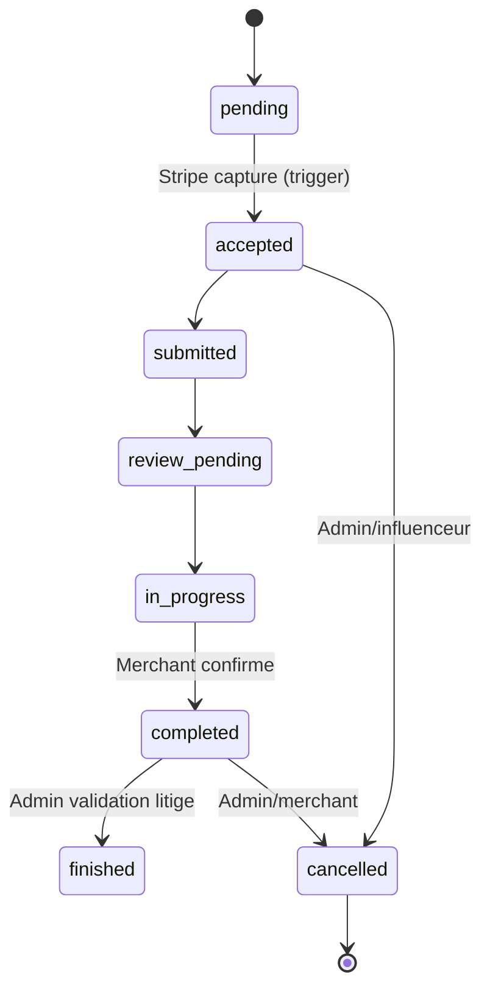

# Workflow Paiement & Escrow (V20)

## Vue d'ensemble
- **Paiement autorisé uniquement** lors de la création de commande (`capture_method=manual`).
- **Capture différée** via acceptation de l'influenceur (trigger Stripe → DB → transition automatique).
- **Disponibilité des revenus** dès la confirmation marchand (`completed` → revenue `available`).
- **Litiges** gérés via `safe_update_order_status` et la réversion conditionnelle des revenus.

## Diagramme des flux de paiement
```mermaid
flowchart TD
  A[Merchant crée commande
  create-payment
  PI manual] --> B{payment_intent.amount_capturable_updated}
  B -->|stripe-webhook| C[orders.stripe_payment_status
  = requires_capture]
  C --> D[Influenceur accepte via
  capture-payment]
  D --> E[orders.stripe_payment_status
  = captured
  trigger -> status=accepted]
  E --> F[Influenceur livre
  submitted/review_pending]
  F --> G[Merchant confirme
  safe_update_order_status(completed)]
  G --> H[revenues.status=available
  available_at=now]
  H --> I[Influenceur déclenche withdrawal
  process-withdrawal]
```

## Transitions d'état métier


## Rappels clés
- **Autorisation Stripe** : `create-payment` crée un PaymentIntent en `manual` pour empêcher toute capture automatique.
- **Capture conditionnelle** : seul `capture-payment` met `stripe_payment_status=captured`, le trigger `sync_stripe_status_to_order` force `status=accepted`.
- **Revenus disponibles** : `safe_update_order_status` insère un revenue `available` + `available_at` au passage `completed` (auto-validation marchand ou timeout géré côté cron).
- **Réversion** : en `cancelled/disputed` après completion, suppression des revenues si non `withdrawn`, sinon log critique.
