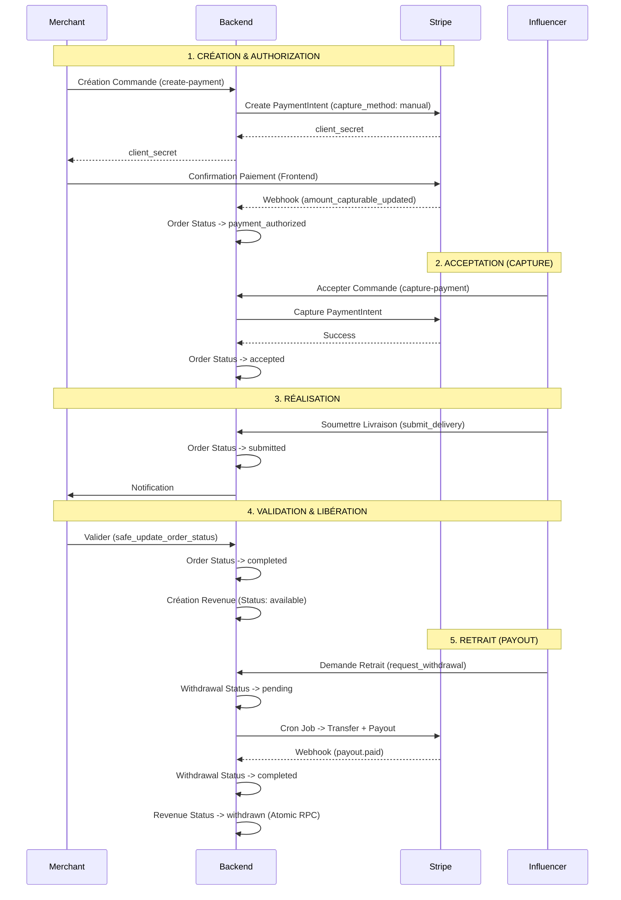

# WORKFLOW MÉTIER & ESCROW

## 1. Vue d'ensemble
Le système repose sur un modèle de **Marketplace Escrow** (Tiers de confiance).
L'argent du commerçant est sécurisé par Stripe et n'est versé à l'influenceur qu'une fois la prestation validée.

## 2. Diagramme des Flux de Paiement

## 3. Transitions de Statuts (Orders)

| Statut | Description | Transition Autorisée Vers |
| :--- | :--- | :--- |
| `pending` | Commande créée, en attente de paiement | `payment_authorized`, `cancelled` |
| `payment_authorized` | Paiement bloqué (Auth), en attente acceptation | `accepted`, `cancelled` |
| `accepted` | Influenceur a accepté, argent capturé | `in_progress`, `cancelled` |
| `in_progress` | Prestation en cours | `submitted`, `cancelled` |
| `submitted` | Livraison effectuée, en attente validation | `review_pending`, `completed`, `disputed` |
| `review_pending` | Commerçant demande modifications | `submitted`, `disputed` |
| `completed` | Validé par commerçant, fonds libérés | `finished`, `disputed` (rare) |
| `finished` | Litige résolu ou archivé | - |
| `cancelled` | Annulé (remboursement ou void auth) | - |
| `disputed` | Litige ouvert | `finished` (validé), `cancelled` (remboursé) |

## 4. Mécanisme Escrow (Sécurité Financière)

### A. Authorization (Blocage des fonds)
Au moment de la commande, les fonds ne sont **PAS** débités définitivement. Une empreinte bancaire (Authorization) est créée.
- Si l'influenceur refuse ou ne répond pas sous 48h : L'empreinte est annulée (Void). Le client n'est pas débité.
- Si l'influenceur accepte : L'empreinte est **Capturée**. L'argent arrive sur le compte Stripe de la plateforme.

### B. Séquestre (Holding)
Les fonds restent sur le compte plateforme tant que la commande n'est pas `completed`.
L'influenceur voit un revenu "En attente".

### C. Libération (Release)
Dès que le commerçant valide la livraison (`completed`), une ligne de `revenues` est créée avec le statut `available`.
L'influenceur peut alors demander un virement.

### D. Retrait (Payout)
Le retrait déclenche un `Transfer` (Plateforme -> Compte Connect Influenceur) suivi immédiatement d'un `Payout` (Compte Connect -> Compte Bancaire).
Cela garantit que la plateforme garde le contrôle des fonds jusqu'au bout.
